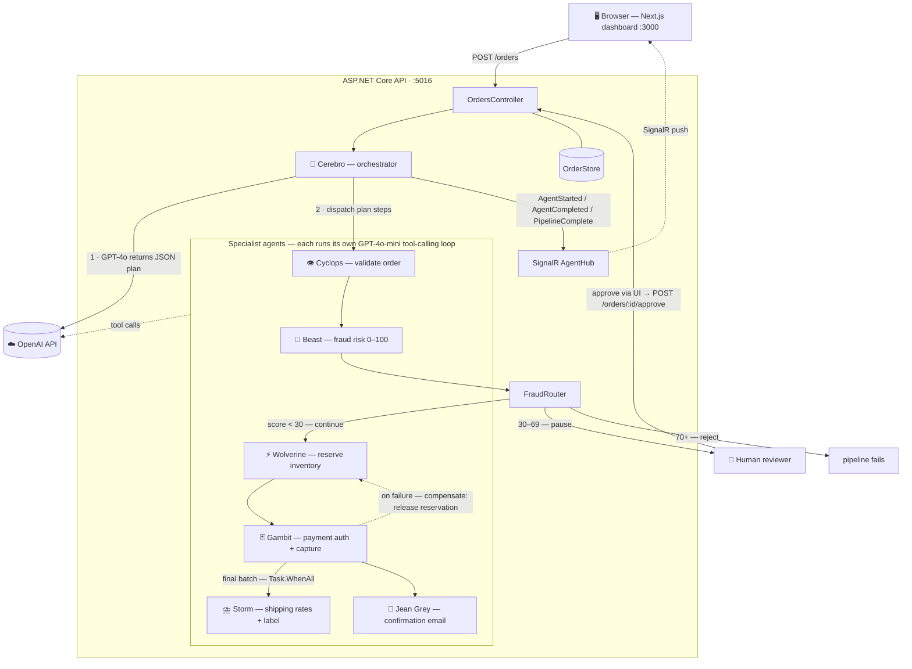

# X-Men Fulfillment System

A multi-agent AI order fulfillment system built to demonstrate production-grade agentic patterns — LLM orchestration, tool-calling, saga/compensation, fraud routing, and human-in-the-loop — wrapped in a real-time dashboard. A team of X-Men, each powered by GPT tool-calling, processes orders through a live pipeline.

---

## Demo

https://github.com/user-attachments/assets/e89b84de-a1ca-4991-8960-4b8491e07c16

**Human review required** — a moderate fraud score pauses the pipeline at `AwaitingApproval`:


**Auto-reject** — a high fraud score stops the pipeline before payment:


**Auto-reject** - item out of stock stops pipeline:


---

## Architecture



**Flow:** `POST /orders` → Cerebro asks GPT-4o for a structured JSON plan → steps execute sequentially (final batch runs in parallel) → every event streams to the browser over SignalR. Beast's risk score routes through `FraudRouter`: under 30 continues, 30–69 pauses for human approval, 70+ rejects. Any failure triggers saga compensation — Wolverine releases reserved inventory.

---

## What It Does

When an order is submitted, **Cerebro** (the orchestrator) asks GPT-4o to produce a fulfillment plan, then dispatches each step to the appropriate specialist agent:

| Agent | Role |
|---|---|
| 🧠 **Cerebro** | Orchestrator — plans via GPT-4o, dispatches agents |
| 👁️ **Cyclops** | Validates order fields and business rules |
| 🧬 **Beast** | Scores fraud risk (0–100) and signals routing |
| ⚡ **Wolverine** | Reserves inventory; releases it if a downstream step fails |
| 🃏 **Gambit** | Authorizes and captures payment |
| ⛈️ **Storm** | Compares shipping rates and creates a label |
| 🔮 **Jean Grey** | Composes and sends the order confirmation email |

Storm and Jean Grey run **in parallel** via `Task.WhenAll`. Every agent uses the OpenAI tool-calling loop to make structured decisions.

---

## Architecture Patterns

- **Orchestrator pattern** — Cerebro plans; agents execute. No agent knows about the pipeline.
- **Tool-calling loop** — each agent drives GPT-4o through a function-calling conversation until it reaches a conclusion.
- **Saga / compensation** — if payment fails after inventory is reserved, Wolverine automatically releases the stock.
- **Fraud routing** — Beast writes a risk score to shared context; `FraudRouter` maps it to a pipeline decision (continue / pause / reject).
- **Human-in-the-loop** — orders scoring 30–69 risk pause at `AwaitingApproval`. A human approves or rejects via the UI; Cerebro resumes from the exact step where it stopped.
- **Real-time UI** — every agent start and completion is broadcast over SignalR so the frontend updates live.

---

## Tech Stack

**Backend**
- ASP.NET Core / .NET 10 — REST API + SignalR hub
- OpenAI .NET SDK — GPT-4o for orchestration planning; GPT-4o-mini tool-calling for specialist agents

**Frontend**
- Next.js 16 (App Router) + Tailwind CSS
- `@microsoft/signalr` — live agent activity feed

**Tests**
- xUnit — 36 passing tests covering `InventoryStore`, `FraudRouter`, Wolverine compensation, and `OrderStore` capacity

---

## Running Locally

### Prerequisites
- [.NET 10 SDK](https://dotnet.microsoft.com/download)
- [Node.js 20+](https://nodejs.org)
- An OpenAI API key

### Backend

```bash
cd backend/XMenFulfillment.Api
# Create appsettings.Development.json (gitignored) with your key:
# { "OpenAI": { "ApiKey": "sk-..." } }
dotnet run --launch-profile http
# API available at http://localhost:5016
```

### Frontend

```bash
cd frontend/cerebro-ui
npm install
# .env.local is already configured for localhost:5016
npm run dev
# UI available at http://localhost:3000
```

### Tests

```bash
cd backend
dotnet test XMenFulfillment.Tests
```

---

## API Endpoints

| Method | Path | Description |
|---|---|---|
| `POST` | `/orders` | Submit an order — runs the full pipeline |
| `GET` | `/orders/{id}/status` | Fetch the fulfillment log for an order |
| `POST` | `/orders/{id}/approve` | Resume a paused (AwaitingApproval) order |
| `POST` | `/orders/{id}/reject` | Reject a paused order |

### Test Scenarios

| Trigger | What happens |
|---|---|
| `pm_ok_test` | Happy path — all agents complete |
| `pm_ok_test` + order total > $1,000, or a disposable email domain | Risk ≥ 30 → paused at `AwaitingApproval`; UI shows Approve / Reject |
| Disposable email + high-risk country + total > $1,000 | Risk ≥ 70 → auto-rejected before payment |
| `pm_capture_fail_*` | Gambit fails → Wolverine releases inventory (Saga) |
| SKU `X-003` | Wolverine detects out-of-stock → pipeline fails |
